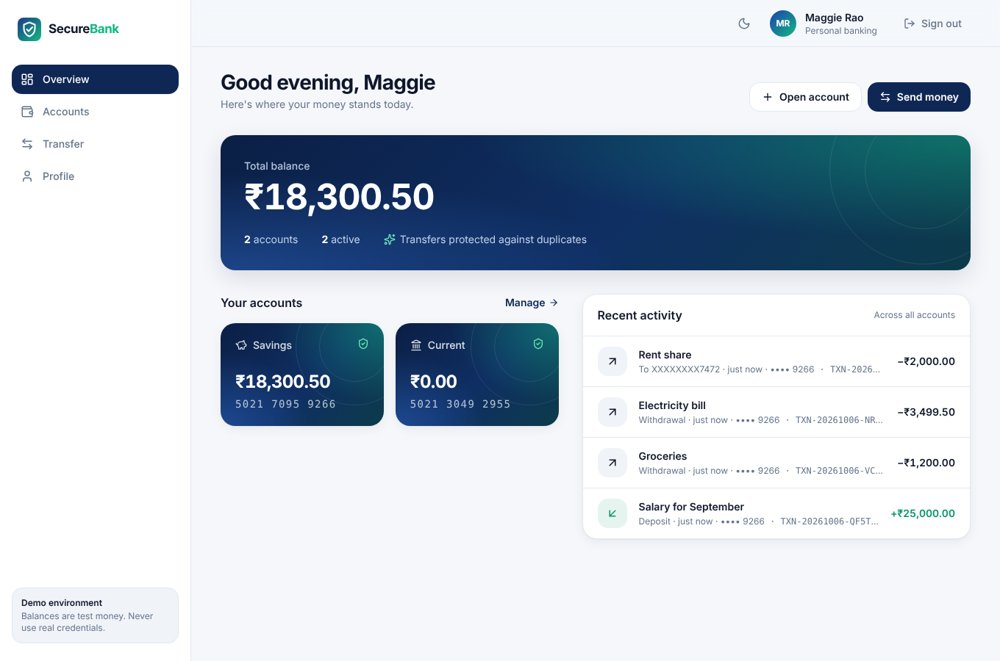
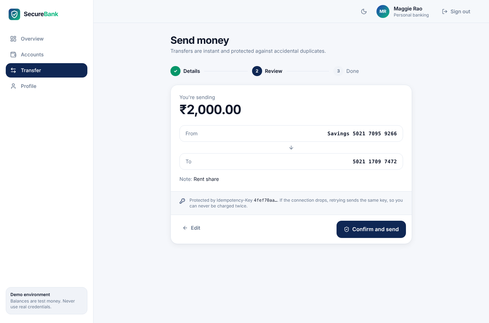
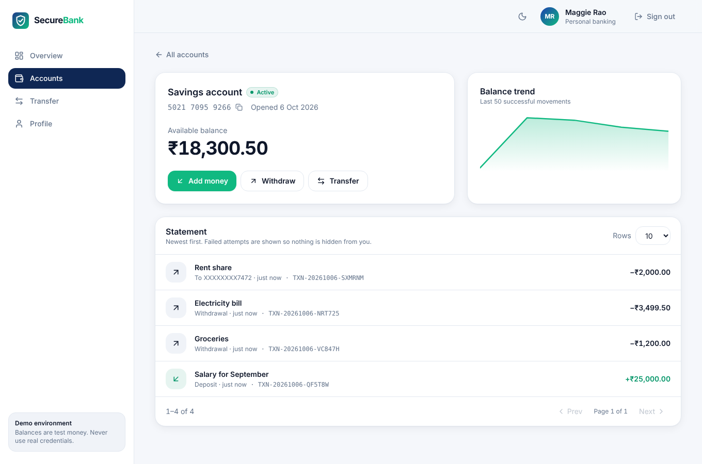
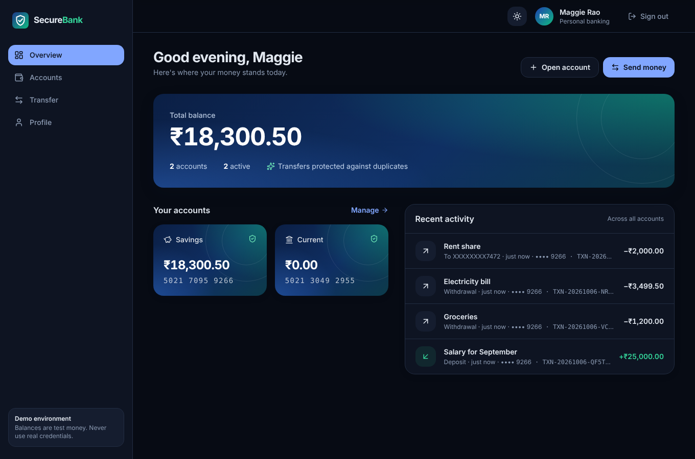
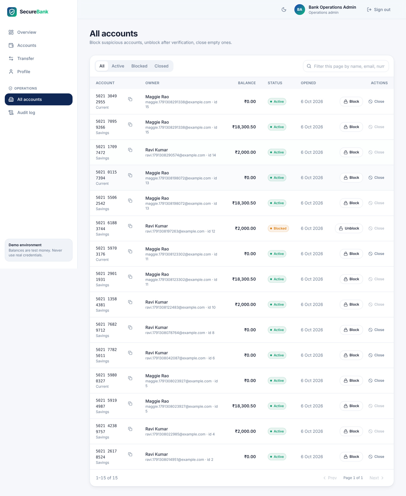

# SecureBank

[](https://github.com/Maggiee18/SecureBank/actions/workflows/ci.yml)

A digital banking application: a Java 17 / Spring Boot 3 REST API plus a React web app. It covers customer registration
and login, bank accounts, deposits, withdrawals, fund transfers and paginated statements, with
most of the effort going into what makes money movement safe: atomic transactions, optimistic
locking, idempotent transfers, audit logging and request tracing.



| Transfer review with idempotency key | Account statement and balance trend |
|---|---|
|  |  |
| **Dark mode** | **Operations console (admin)** |
|  |  |

This is a portfolio project, not a production bank. The last sections spell out what is
simplified and what a real deployment would need.

## Why I built it

Most CRUD tutorials stop at "save the entity". In banking the hard questions start after that:

* What if the server crashes halfway through a transfer?
* What if two withdrawals hit the same account in the same millisecond?
* What if the mobile app times out and the customer taps "Pay" again?
* When a customer calls support about a failed payment, how do you find it in the logs?

SecureBank is my attempt to answer those questions in code that a reviewer can read in an
afternoon.

## Features

| Area | What is implemented |
|---|---|
| Authentication | Registration, login, JWT (HS256), BCrypt password hashing, stateless security |
| Authorization | CUSTOMER and ADMIN roles, URL rules plus `@PreAuthorize`, account ownership checks in the service layer |
| Brute force protection | Login lockout after 5 failed attempts for 15 minutes (in memory) |
| Customers | View and update own profile |
| Accounts | SAVINGS and CURRENT accounts, generated 12 digit account numbers, ACTIVE / BLOCKED / CLOSED status |
| Money | Deposit, withdrawal and transfer with no overdrafts, `BigDecimal` everywhere |
| Transactions | `@Transactional` transfers, rollback on any failure, ascending lock order |
| Concurrency | Optimistic locking with `@Version`, conflicts returned as 409 |
| Idempotency | `Idempotency-Key` header, stored response replay, payload mismatch detection |
| History | Paginated, sortable statements with masked counterparty account numbers |
| Audit | Security and business events with outcome, IP and request id |
| Tracing | `X-Request-ID` propagated or generated, included in every log line and error response |
| Errors | One JSON error format with stable error codes, no stack traces |
| Operations | Actuator health, liveness and readiness probes, info |
| Docs | Swagger UI with JWT "Authorize" button |
| Tests | Mockito unit tests and Spring Boot integration tests (MockMvc + H2), including concurrency and rollback |
| Web app | React 19 + TypeScript + Tailwind: dashboard, accounts, deposits and withdrawals, three step transfers with a live idempotency replay demo, statements with balance trend, profile, admin console, dark mode, mobile layout |
| Delivery | Multi stage Dockerfiles and Docker Compose (PostgreSQL + API + web on nginx), GitHub Actions CI for both |

## Tech stack

**Backend:** Java 17, Spring Boot 3.3, Spring Web, Spring Data JPA (Hibernate 6), Spring Security 6,
JJWT 0.12, Jakarta Bean Validation, PostgreSQL 16, Flyway, springdoc OpenAPI, Spring Boot
Actuator, SLF4J with Logback, JUnit 5, Mockito, H2 (tests only), Docker.

**Frontend:** React 19, TypeScript, Vite, Tailwind CSS, React Router, TanStack Query, lucide icons. No UI component
library: the small design system (buttons, fields, modals, badges, tokens for light and dark) lives in
`frontend/src/components/ui`.

No Lombok, no MapStruct, no Redis, no message broker. Each one would hide or add something I
would then have to explain without it adding to what the project is trying to show.

## Architecture

A layered modular monolith. One deployable, one database.

```
Client
  │  Authorization: Bearer <JWT>   X-Request-ID   Idempotency-Key
  ▼
RequestIdFilter ............ request id into MDC and response header
  ▼
Spring Security ............ JwtAuthenticationFilter → SecurityContext → URL rules
  ▼
Controller ................. validates DTOs, picks status codes, nothing else
  ▼
Service .................... business rules, @Transactional, audit, idempotency
  ▼
Repository ................. Spring Data JPA
  ▼
PostgreSQL ................. constraints, indexes, Flyway migrations
```

### Package structure

```
com.securebank
├── SecureBankApplication
├── config        Clock, configuration properties, OpenAPI, admin bootstrap
├── controller    Auth, Customer, Account, Transfer, Admin controllers
├── dto           auth / customer / account / transaction / admin / common records
├── entity        Customer, Account, BankTransaction, AuditLog, IdempotencyRecord + enums
├── exception     ErrorCode, BankingException hierarchy, GlobalExceptionHandler
├── repository    Spring Data repositories
├── security      SecurityConfig, JwtService, JwtAuthenticationFilter, LoginAttemptService, ...
├── service       AuthService, CustomerService, AccountService, TransactionHistoryService, AuditService
│   ├── money         MoneyOperationFacade, CashTransactionService, TransferService, FailedOperationRecorder
│   └── idempotency   IdempotencyService, RequestHasher, ClaimResult
├── util          account number and transaction reference generators, masking
└── web           RequestIdFilter, RequestContext
```

```
frontend/src
├── main.tsx, App.tsx      providers and routes (auth, admin and public guards)
├── lib/                   api client + error model, endpoints, auth session, theme, toasts, formatting
├── hooks/queries.ts       TanStack Query hooks and cache invalidation after money moves
├── components/ui/         design system: Button, Field, Modal, Badge, feedback states, Logo
├── components/layout/     AppShell (sidebar, header), AuthLayout
├── components/money.tsx   account cards, statement rows, balance trend, deposit/withdraw/open account modals
└── pages/                 Login, Register, Dashboard, Accounts, AccountDetail, Transfer, Profile, admin/*
```

`docs/ARCHITECTURE.md` has the full design notes.

## Database design

Schema lives in `src/main/resources/db/migration/V1__create_core_schema.sql` and is applied by
Flyway. Hibernate never generates tables (`ddl-auto: none`).

```
customers ──1:N── accounts ──1:N── bank_transactions (source_account_id / destination_account_id)
customers ──1:N── idempotency_records
audit_logs.customer_id (plain column, intentionally no FK)
```

| Table | Notable constraints |
|---|---|
| customers | unique email, role check |
| accounts | unique account_number, FK to customer, `CHECK (balance >= 0)`, `@Version` column |
| bank_transactions | unique transaction_reference, `CHECK (amount > 0)`, FKs to both accounts |
| audit_logs | no FK so failed logins for unknown emails can still be recorded |
| idempotency_records | `UNIQUE (customer_id, idempotency_key)` |

Money columns are `NUMERIC(19,2)`. The balance check constraint is a last line of defence: even if
a bug slipped past the Java checks, PostgreSQL would refuse to commit a negative balance.

### Indexes

| Index | Used by |
|---|---|
| `uk_customers_email` | login lookup |
| `uk_accounts_account_number` | every account operation |
| `idx_accounts_customer_id` | "list my accounts" |
| `idx_txn_source_created (source_account_id, created_at)` | statement: money sent |
| `idx_txn_destination_created (destination_account_id, created_at)` | statement: money received |
| `idx_audit_customer_created`, `idx_audit_action_created` | support investigations |
| `uk_idempotency_customer_key` | idempotency lookup and race protection |

The statement query is `source = ? OR destination = ?`, which PostgreSQL can serve by combining
the two composite indexes (BitmapOr). Account first, time second matches "this account, newest
first".

## API endpoints

| Method | Path | Who | Success |
|---|---|---|---|
| POST | `/api/v1/auth/register` | public | 201 |
| POST | `/api/v1/auth/login` | public | 200 |
| GET | `/api/v1/customers/me` | customer | 200 |
| PUT | `/api/v1/customers/me` | customer | 200 |
| POST | `/api/v1/accounts` | customer | 201 |
| GET | `/api/v1/accounts` | customer | 200 |
| GET | `/api/v1/accounts/{accountNumber}` | owner | 200 |
| GET | `/api/v1/accounts/{accountNumber}/balance` | owner | 200 |
| POST | `/api/v1/accounts/{accountNumber}/deposit` | owner | 201 |
| POST | `/api/v1/accounts/{accountNumber}/withdraw` | owner | 201 |
| POST | `/api/v1/transfers` | owner of source | 201 |
| GET | `/api/v1/accounts/{accountNumber}/transactions` | owner | 200 |
| PATCH | `/api/v1/admin/accounts/{accountNumber}/status` | ADMIN | 200 |
| GET | `/api/v1/admin/accounts?status=` | ADMIN | 200 |
| GET | `/api/v1/admin/audit-logs` | ADMIN | 200 |
| GET | `/actuator/health`, `/actuator/health/liveness`, `/actuator/health/readiness`, `/actuator/info` | public | 200 |

### Status codes

| Code | When |
|---|---|
| 201 | Something was created: customer, account, or a transaction record (deposit, withdrawal, transfer) |
| 400 | Bean Validation failure, malformed JSON, missing `Idempotency-Key`, bad sort field |
| 401 | No token, bad or expired token, wrong credentials |
| 403 | Authenticated but not your account, or not an admin |
| 404 | Account or customer does not exist |
| 409 | Email already registered, concurrent update, same idempotency key still processing |
| 422 | Valid request that breaks a business rule: insufficient balance, blocked or closed account, transfer to same account, idempotency key reused with a different body |
| 429 | Too many failed logins |

I separated 400 from 422 on purpose. 400 means "fix your request". 422 means "your request was
fine, the bank said no". Client apps show those very differently.

## Authentication flow

1. **Register**: the request is validated (email format, Indian mobile number, password strength,
   max 72 characters because BCrypt ignores anything longer). Email is lower cased, the password is
   hashed with BCrypt (cost 12) and only the hash is stored.
2. **Login**: `AuthenticationManager` loads the user through `CustomUserDetailsService` and lets
   BCrypt compare. The error message is identical for "unknown email" and "wrong password", so
   attackers cannot find out which emails exist.
3. **Token**: an HS256 JWT with `sub` (customer id), `email`, `role`, `iss`, `iat` and `exp`
   (30 minutes). It is signed with `JWT_SECRET`, which has no default; the app refuses to start
   without it.
4. **Each request**: `JwtAuthenticationFilter` checks signature, issuer and expiry, then puts an
   `AuthenticatedCustomer` principal in the `SecurityContext`. No session, no cookie, no database
   hit.
5. **Authorization**: `/api/v1/admin/**` requires ROLE_ADMIN (URL rule and `@PreAuthorize`).
   Ownership is checked in `AccountService.getOwnedAccount`, the single method every account
   operation goes through.

## Transfer flow

```
POST /api/v1/transfers  (Idempotency-Key: 8d9f7a21-...)
 │
 ├─ MoneyOperationFacade (not transactional)
 │    ├─ IdempotencyService.claim()           own short transaction
 │    │     new key        → insert IN_PROGRESS row, continue
 │    │     completed key  → return stored response, stop (no money moves)
 │    │     running key    → 409
 │    │     different body → 422
 │    │
 │    ├─ BEGIN ─────────────────────────────────────────────────────────
 │    │   TransferService.transfer()
 │    │     load source (must belong to caller) and destination
 │    │     reject same account, inactive accounts, insufficient balance
 │    │     debit / credit in ascending account id order, flush (version check)
 │    │     insert bank_transactions row (SUCCESS)
 │    │     insert audit_logs row (TRANSFER, SUCCESS)
 │    │   IdempotencyService.complete()  store response JSON
 │    └─ COMMIT ────────────────────────────────────────────────────────
 │
 └─ on any exception: everything above is rolled back, then
      release the idempotency key,
      write FAILED transaction row (business rule failures only) and FAILURE audit row
      in a new transaction, and return the error
```

`@Transactional` sits on the service layer because that is where a complete business operation
lives. Controllers deal with HTTP; repositories deal with one table each. Only the service knows
that debit, credit, ledger row and audit row must succeed or fail together. Spring wraps the
service bean in a proxy that opens the transaction before the method and commits after it, or rolls
back if a RuntimeException escapes.

### Rollback example

Account A has ₹10,000, account B has ₹0. A transfer of ₹2,000 debits A and credits B (both rows are
already flushed to PostgreSQL inside the transaction), then writing the transaction record fails.
Spring rolls back the database transaction: A is still ₹10,000, B is still ₹0, and no transaction
row exists. `TransferRollbackIntegrationTest` forces exactly this failure.

## Money representation

All amounts are `BigDecimal` in Java and `NUMERIC(19,2)` in PostgreSQL. `double` stores numbers in
binary, and most decimal fractions (0.1, 0.2) have no exact binary form, so
`0.1 + 0.2 = 0.30000000000000004`. Over thousands of transactions those errors add up and a ledger
stops balancing. `AccountTest` has a test that subtracts 0.10 and 0.20 and expects exactly 999.70.

Amounts are validated with `@DecimalMin("0.01")` and `@Digits(integer = 15, fraction = 2)`, so
negative, zero and sub-paisa amounts never reach the service layer.

## Concurrency handling

**The race:** balance ₹1,000. Request A withdraws ₹800, request B withdraws ₹700, at the same time.
Both read ₹1,000, both pass the balance check, both write. Without protection one write silently
overwrites the other and the bank has paid out ₹1,500 from a ₹1,000 account.

**The fix:** `Account` has a `@Version` column. Hibernate turns every update into

```sql
UPDATE accounts SET balance = ?, version = version + 1 WHERE id = ? AND version = ?
```

Whichever request commits first wins. The second one's `WHERE version = ?` matches zero rows,
Hibernate throws `ObjectOptimisticLockingFailureException`, the transaction rolls back and the
client gets **409 CONCURRENT_UPDATE**. If B arrives slightly later instead, it reads ₹200 and gets
**422 INSUFFICIENT_BALANCE**. Either way exactly one withdrawal succeeds.

**Why optimistic and not pessimistic (`SELECT ... FOR UPDATE`):** conflicts on the same account are
rare, and optimistic locking holds no row locks while the request runs. The cost is that the loser
has to retry, which is safe because it can resend with the same `Idempotency-Key`. For a very hot
account (a merchant receiving thousands of payments a second) I would switch to pessimistic locking
or a ledger design.

**Deadlocks:** a transfer updates two rows. If A→B and B→A run together and each locks its source
first, they wait for each other forever. `TransferService` always updates the lower account id
first, so both transfers queue on the same row instead.

Two integration tests cover this: one fires both withdrawals in parallel threads, the other
deterministically holds a stale copy of the account while another request commits.

## Idempotency

Mobile networks drop responses. If the app times out and retries a ₹5,000 transfer, the customer
must not lose ₹10,000.

The client sends a unique `Idempotency-Key` (a UUID) per intended transfer:

* First request: a row `(customer_id, key, request_hash, IN_PROGRESS)` is inserted, the transfer
  runs, and the response JSON is stored in that row **in the same database transaction as the
  transfer**. Either both commit or neither does.
* Same key, same body: the stored response is returned with `Idempotent-Replayed: true`. No money
  moves.
* Same key, different body: 422 `IDEMPOTENCY_KEY_REUSED`. This catches client bugs that reuse keys.
* Same key while the first is still running: 409 `IDEMPOTENCY_REQUEST_IN_PROGRESS`.
* First request failed (for example low balance): the key is released so the client can retry
  once the problem is fixed.

The unique constraint on `(customer_id, idempotency_key)` is what makes this safe under
concurrency. Two identical requests arriving together both try to insert; PostgreSQL lets exactly
one win. Keys are scoped per customer so one customer's key can never collide with another's.

The key is required for transfers and optional for deposits and withdrawals.

## Audit logging

`audit_logs` records REGISTER, LOGIN, LOGIN_FAILED, PROFILE_UPDATED, ACCOUNT_CREATED,
ACCOUNT_STATUS_CHANGED, DEPOSIT, WITHDRAWAL and TRANSFER, each with customer id, resource, outcome,
description, client IP and request id. Passwords and tokens are never written.

Successful operations write their audit row inside the business transaction, so a rolled back
transfer leaves no "success" audit. Failed operations write theirs in a separate transaction
**after** the rollback, so the evidence of the failed attempt survives.

Why it matters: security investigations (who logged in from where, how many failed attempts),
customer disputes ("I never made this transfer"), operational support, and accountability for
admin actions such as blocking an account.

## Request tracing

`RequestIdFilter` runs before Spring Security. If the client sends `X-Request-ID` (letters,
digits, `.`, `_`, `-`, up to 64 characters) it is reused; otherwise a UUID is generated. The id
goes into the SLF4J MDC, the response header, every error body, every audit row and every
transaction row.

A log line looks like this:

```
INFO [requestId=7f83a9d2] [customerId=12] c.s.service.money.MoneyOperationFacade : TRANSFER_STARTED account=502133557148 amount=2000.00
INFO [requestId=7f83a9d2] [customerId=12] c.s.service.money.TransferService      : TRANSFER_SUCCESS ref=TXN-20261006-A8F42K from=502133557148 to=502126037770 amount=2000.00
INFO [requestId=7f83a9d2] [customerId=12] c.s.service.money.MoneyOperationFacade : TRANSFER_COMPLETED account=502133557148
```

When a customer reports a failed payment, support can start from the transaction reference or
the request id shown in the app, grep one id, and see the whole story across filter, security,
service and database layers. Header values are pattern checked so nobody can inject fake log lines.

## Validation and exception handling

Bean Validation on every request DTO, with field level messages:

```json
{
  "timestamp": "2026-10-06T10:15:30Z",
  "status": 400,
  "error": "VALIDATION_FAILED",
  "message": "Request validation failed",
  "path": "/api/v1/auth/register",
  "requestId": "7f83a9d2",
  "fieldErrors": [
    { "field": "password", "message": "Password must contain upper case, lower case, a digit and a special character" }
  ]
}
```

`GlobalExceptionHandler` maps every exception to this shape. Business exceptions extend
`BankingException` and carry an `ErrorCode` that knows its HTTP status, so one handler covers all
of them. Security errors that happen in the filter chain (before any controller) are written in
the same format by `RestAuthenticationEntryPoint` and `RestAccessDeniedHandler`. Unexpected errors
return a generic 500 with the request id; the stack trace only goes to the log.

## DTOs

Controllers never return entities. Request and response DTOs are Java records:

* the password hash cannot leak, because no response type has a field for it
* the API contract does not change when the database schema changes
* lazy JPA relationships cannot blow up during JSON serialisation
* validation rules live on the input types where they belong

## Testing

```
src/test/java/com/securebank
├── entity/AccountTest                          domain rules: overdraft, status, exact decimals
├── service/AuthServiceTest                     registration, duplicate email, login, lockout
├── service/TransactionHistoryServiceTest       pagination metadata, sort whitelist
├── service/money/CashTransactionServiceTest     deposit, withdrawal, insufficient balance, blocked, not owner
├── service/money/TransferServiceTest           transfer, lock order, same account, blocked, unknown, not owner
├── service/money/MoneyOperationFacadeTest      replay, key release on failure, failure recording, 409 mapping
├── service/idempotency/IdempotencyServiceTest  claim, replay, payload mismatch, in progress, race loser
├── security/LoginAttemptServiceTest            lockout and expiry with a controllable clock
├── dto/RequestValidationTest                   amount, account number, password rules
├── web/RequestIdFilterTest                     propagation and log injection protection
└── integration/                                full Spring context + MockMvc + H2 (PostgreSQL mode) + Flyway
    ├── AuthAndAccountIntegrationTest           401/403/404/409/429, profile, accounts, health
    ├── MoneyFlowIntegrationTest                money flows, idempotency, pagination, admin block
    ├── ConcurrencyIntegrationTest              parallel withdrawals, stale version rejection
    └── TransferRollbackIntegrationTest         failure after debit/credit rolls everything back
```

* **Unit tests** use Mockito and test one class's business rules in milliseconds.
* **Integration tests** start the whole application and call it over HTTP through MockMvc, so
  security, validation, JSON, transactions and SQL are all exercised together.
* H2 runs in PostgreSQL compatibility mode for speed. Testcontainers with a real PostgreSQL would
  be the next step.

Run them with:

```bash
mvn test
```

## Web app

`frontend/` is a single page React app that talks to the API.

| Screen | What it shows off |
|---|---|
| Sign in / register | Password rules mirrored from the backend, generic login errors, lockout message with retry time |
| Overview | Total balance, account cards, recent activity merged across accounts |
| Account | Balance, deposit and withdraw modals, paginated statement (failed attempts included), balance trend rebuilt from the statement |
| Transfer | Details → review → receipt. A fresh `Idempotency-Key` per transfer; on a timeout the "Retry safely" button resends the same key. The receipt has a **Send the same request again** button that shows the server replaying the original result with `Idempotent-Replayed: true` |
| Profile | Edit name and phone, session expiry |
| Admin | All accounts with owners, block / unblock / close with a reason, audit log filtered by customer |

Design decisions:

* **Every request sends its own `X-Request-ID`** (`web-xxxxxxxx`), so even a request that never got a response
  has a reference the customer can quote. Error toasts show it with a copy button.
* **The JWT is kept in sessionStorage** so a refresh keeps you signed in but closing the tab does not. The app
  signs out exactly when the token expires and on any 401. A real bank would use an httpOnly cookie through a
  backend for frontend, so page scripts can never read the token.
* **Admin screens are hidden for customers, but that is only convenience**: the API enforces ROLE_ADMIN itself.
* Amounts are sent as strings like `"2000.00"`, never as floating point numbers.

## Swagger

Open http://localhost:8080/swagger-ui.html

1. `POST /api/v1/auth/register`
2. `POST /api/v1/auth/login` and copy `accessToken`
3. Click **Authorize**, paste the token (without the word Bearer)
4. Call any protected endpoint

Set `SWAGGER_ENABLED=false` to switch the UI and spec off.

## Actuator

Only `health` and `info` are exposed, and health shows no component details publicly.

* `/actuator/health/liveness`: is the process alive? If not, the orchestrator restarts it.
* `/actuator/health/readiness`: can it serve traffic (database reachable, startup finished)? If
  not, the load balancer stops sending requests, but the process is left running.

The Docker image uses the readiness endpoint as its `HEALTHCHECK`. If PostgreSQL goes down,
readiness reports DOWN, requests fail fast with a 500 carrying a request id, and Hikari reconnects
by itself when the database is back.

## Running locally

### Option 1: Docker Compose (easiest)

```bash
cp .env.example .env        # then edit the values, especially JWT_SECRET
docker compose up --build
```

Web app on http://localhost:3000, API on http://localhost:8080, PostgreSQL on localhost:5432. nginx serves the
web app and forwards `/api` to the backend, so the browser sees a single origin.

### Option 2: Maven + your own PostgreSQL

```sql
CREATE USER securebank WITH PASSWORD 'securebank';
CREATE DATABASE securebank OWNER securebank;
```

```bash
# Linux / macOS
export SPRING_PROFILES_ACTIVE=dev       # dev profile supplies a local only JWT secret and DB password
mvn spring-boot:run

# Windows PowerShell
$env:SPRING_PROFILES_ACTIVE="dev"
mvn spring-boot:run
```

Flyway creates the tables on first start. Without the `dev` profile you must set `JWT_SECRET`
yourself.

Then start the web app (Node 20 or newer):

```bash
cd frontend
npm install
npm run dev                 # http://localhost:5173, /api is proxied to localhost:8080
```

### Deploying the web app separately

On Vercel or Netlify, set the project root to `frontend`, the build command to `npm run build`, the output to
`dist`, and `VITE_API_BASE_URL` to your API URL. Add the web app's URL to the API's `CORS_ALLOWED_ORIGINS`.
`vercel.json` and `public/_redirects` make client side routes like `/accounts/502133557148` work on refresh.

### Environment variables

| Variable | Default | Notes |
|---|---|---|
| `DB_URL` | `jdbc:postgresql://localhost:5432/securebank` | |
| `DB_USERNAME` | `securebank` | |
| `DB_PASSWORD` | empty (`securebank` in dev profile) | |
| `JWT_SECRET` | none, **required** | 32+ characters, e.g. `openssl rand -base64 48` |
| `JWT_EXPIRATION` | `PT30M` | ISO 8601 duration |
| `LOGIN_MAX_ATTEMPTS` | `5` | |
| `LOGIN_LOCK_DURATION` | `PT15M` | |
| `ADMIN_EMAIL`, `ADMIN_PASSWORD` | empty | if both set, an ADMIN user is created at startup |
| `SWAGGER_ENABLED` | `true` | |
| `CORS_ALLOWED_ORIGINS` | `http://localhost:5173,http://localhost:3000` | browser origins allowed to call the API |
| `SERVER_PORT` | `8080` | |

## Example requests

```bash
# Register
curl -X POST localhost:8080/api/v1/auth/register -H "Content-Type: application/json" \
  -d '{"fullName":"Maggie Rao","email":"maggie@example.com","phone":"9876543210","password":"Str0ng@Pass"}'

# Login
TOKEN=$(curl -s -X POST localhost:8080/api/v1/auth/login -H "Content-Type: application/json" \
  -d '{"email":"maggie@example.com","password":"Str0ng@Pass"}' | jq -r .accessToken)

# Open an account
curl -X POST localhost:8080/api/v1/accounts -H "Authorization: Bearer $TOKEN" \
  -H "Content-Type: application/json" -d '{"accountType":"SAVINGS"}'

# Deposit
curl -X POST localhost:8080/api/v1/accounts/502133557148/deposit -H "Authorization: Bearer $TOKEN" \
  -H "Content-Type: application/json" -d '{"amount":10000.00,"description":"Salary"}'

# Transfer (run it twice with the same key: the second call replays, no money moves)
curl -i -X POST localhost:8080/api/v1/transfers -H "Authorization: Bearer $TOKEN" \
  -H "Idempotency-Key: 8d9f7a21-4c1e-4b0a-9d55-0e7c1f2a3b4c" -H "X-Request-ID: 7f83a9d2" \
  -H "Content-Type: application/json" \
  -d '{"sourceAccountNumber":"502133557148","destinationAccountNumber":"502126037770","amount":2000.00,"description":"Rent"}'

# Statement
curl "localhost:8080/api/v1/accounts/502133557148/transactions?page=0&size=10&sort=createdAt,desc" \
  -H "Authorization: Bearer $TOKEN"
```

### Example responses

Transfer, 201 Created, header `Idempotent-Replayed: false`:

```json
{
  "transactionReference": "TXN-20261006-A8F42K",
  "status": "SUCCESS",
  "sourceAccountNumber": "502133557148",
  "destinationAccountNumber": "502126037770",
  "amount": 2000.00,
  "sourceBalanceAfter": 8000.00,
  "description": "Rent",
  "createdAt": "2026-10-06T10:15:30.123Z"
}
```

Statement, 200 OK:

```json
{
  "content": [
    {
      "transactionReference": "TXN-20261006-A8F42K",
      "type": "TRANSFER",
      "direction": "DEBIT",
      "status": "SUCCESS",
      "amount": 2000.00,
      "counterpartyAccount": "XXXXXXXX7770",
      "description": "Rent",
      "createdAt": "2026-10-06T10:15:30.123Z"
    }
  ],
  "page": 0,
  "size": 10,
  "totalElements": 2,
  "totalPages": 1,
  "first": true,
  "last": true,
  "sort": "createdAt: DESC"
}
```

Insufficient balance, 422:

```json
{
  "timestamp": "2026-10-06T10:16:02.511Z",
  "status": 422,
  "error": "INSUFFICIENT_BALANCE",
  "message": "Insufficient balance in account 502133557148",
  "path": "/api/v1/transfers",
  "requestId": "7f83a9d2"
}
```

## Simplified on purpose (portfolio decisions)

| Here | In a real bank |
|---|---|
| Balance column updated in place | Double entry ledger: every movement is two immutable entries, balance is derived or reconciled |
| HS256 JWT with one shared secret | Asymmetric keys (RS256/ES256) from a KMS or HSM, key rotation, short lived access tokens plus refresh tokens, revocation |
| Login lockout in memory | Shared store (Redis) or API gateway rate limiting, per IP and per device limits, CAPTCHA |
| No MFA | OTP / device binding / step up auth for transfers |
| Deposits are a REST call | Deposits come from branch, ATM or payment rails, not the customer's API |
| No transaction limits | Daily limits, beneficiary cooling periods, fraud scoring |
| H2 in integration tests | Testcontainers with the same PostgreSQL version as production |
| Single instance | Multiple instances behind a load balancer, which is why lockout state would move to Redis |
| Stuck IN_PROGRESS idempotency key if the process dies mid request | Expiry and recovery job for stale keys |
| Logs to console | Centralised logging (ELK / Loki), metrics, alerts, distributed tracing |

This project does **not** claim regulatory compliance (RBI, PCI DSS) or production readiness.

## Future improvements

* Double entry ledger table and nightly reconciliation
* Refresh tokens and token revocation
* Testcontainers based integration tests
* Per transaction and daily limits
* Recurring transfers (design in `docs/ARCHITECTURE.md`): a scheduler picking due rows with
  `FOR UPDATE SKIP LOCKED` and calling the existing facade with a deterministic idempotency key
  like `recurring-{id}-{date}`
* Micrometer metrics for transfer latency and failure rates
* Extend the GitHub Actions pipeline (`.github/workflows/ci.yml`, which already runs `mvn verify`) to build and scan the Docker image
